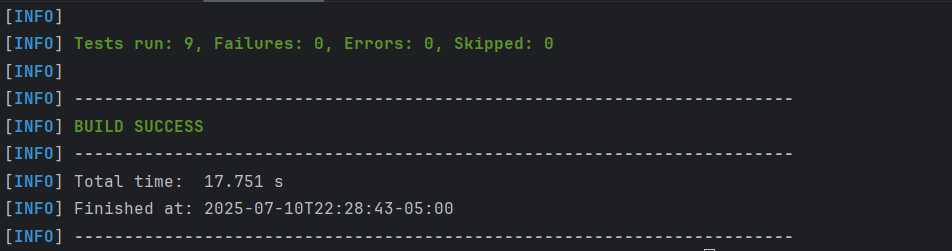

# Franquicia Backend - Prueba Técnica

## 📋 Descripción
Backend reactivo para gestión de tareas desarrollado con:
- API REST reactiva para crear, actualizar, eliminar y listar tareas por categoría.
- Arquitectura limpia con separación de capas: `application`, `domain`, `infrastructure`.
- Persistencia en **MongoDB** de manera no bloqueante.
- Pruebas unitarias con **JUnit 5 y Mockito**.
- Documentación automática de API con **Swagger OpenAPI (springdoc)**.
- Despliegue y entorno reproducible con **Docker Compose**.
- Seguridad basada en JWT.

## 🏗️ Estructura Clean Architecture

```text
src/main/java/com/accenture/to_do_List_backend/
├── application/          # Capa de aplicación
│   ├── dto/              # Objetos de transferencia
│   └── service/          # Lógica de negocio reactiva
├── domain/               # Núcleo del dominio
│   ├── model/            # Entidades
│   └── repository/       # Interfaces repositorio
└── infrastructure/       # Detalles de infra
    ├── config/           # Configuraciones
    └── web/              # Controladores y excepciones
```
### ¿Por qué Clean Architecture?
Se sigue Clean Architecture para garantizar:

**Separación de responsabilidades:** cada capa tiene un propósito claro.

**Independencia de frameworks:** el dominio no depende de Spring.

**Alta mantenibilidad y testabilidad:** cada componente puede ser probado de forma aislada.

**Escalabilidad:** permite adaptar o cambiar tecnología sin afectar reglas de negocio.

## 🚀 Instrucciones para ejecutar con Docker Compose

### ✅ Requisitos previos

- Tener instalado [Docker](https://www.docker.com/get-started) y [Docker Compose](https://docs.docker.com/compose/).
- Verificar que el puerto `8080` (backend) y `27017` (MongoDB para version en local) estén libres.

### 📂 Estructura relevante

El proyecto contiene un archivo `docker-compose.yml` que define:

- Un contenedor de MongoDB.
- El contenedor de la aplicación backend construido desde el `Dockerfile`.

### 📦 Paso a paso para construir y levantar los contenedores

1. **Clonar el repositorio**:

```bash
git clone https://github.com/SantiagoTabares/to-do_List_backend.git
cd to-do_List_backend
```

Para este proyecto se tiene varias opciones de despliegue, puedes elegir entre:

- Versión con MongoDB en MongoDB Atlas (Cloud)
- Versión con MongoDB en un contenedor 


**Versión con MongoDB en MongoDB Atlas (Cloud):**
```bash
docker-compose up --build
```

**Versión con MongoDB en un contenedor:**

Se utiliza el archivo `docker-compose.locadb.yml` que se encuentra en la raíz del proyecto.

Construir y levantar servicios**:

```bash
docker-compose -f docker-compose.localdb.yml up -d
```

Para detener los servicios, usa:

```bash
docker-compose down
```
3. **Verificar que todo esté funcionando**:

   - Accede a la API en `http://localhost:8080/webjars/swagger-ui/index.html`.


## Funcionamiento de la API

Desde la interfaz de Swagger, puedes los endpoints disponibles, pero se debe realizar autenticación para acceder a los recursos de tareas y categorías.

### Autenticación
Para autenticarte, utiliza el endpoint `/auth/register` para crear un usuario y luego `/auth/login` para obtener un token JWT. Este token se debe incluir en el header `Authorization` de las peticiones a los endpoints protegidos.:


Con el token obtenido se agrega en 'Authorize' en la parte superior, puedes acceder a los endpoints de tareas y categorías. Por ejemplo, para listar las tareas:


**Nota:** El SECRET_KEY esta en el repositorio ya que es una prueba tecnica, en un entorno real se recomienda almacenarlo de forma segura y no exponerlo en el código fuente, al igual que las credenciales de la base de datos.


Ya con eso se podrán probar todas las funcionalidades de la API


## 🧪 Pruebas unitarias
Se realia un ejemplo de pruebas unitarias con JUnit 5 y Mockito, enfocadas en los servicios y controladores principales:
- AuthControllerTest

- AuthServiceImplTest


Las pruebas unitarias están implementadas utilizando JUnit 5 y Mockito. Para ejecutarlas, puedes usar el siguiente comando:

```bash
./mvnw test
```




## 🔧 Posibles mejoras
- **Implementar paginación y ordenamiento** en las listas de franquicias, sucursales y productos.
- **Agregar validaciones más robustas** en los DTOs y servicios.
- **Implementar un sistema de roles y permisos** para controlar el acceso a los recursos.
- **Mejora en la implementación de manejo de excepciones global** para una mejor gestión de errores.
- **Crear Dto y mappers para todos los procesos de la API para evitar utilizar modelos directamente en los controladores.**
- **Implementar pruebas de integración** para verificar el flujo completo.
- **Optimizar consultas a MongoDB** para mejorar el rendimiento en grandes volúmenes de datos.

## Despliegue en la nube

Actualmente se encuentra desplegado en la nube de railway:

https://backendtestaccenture.up.railway.app/webjars/swagger-ui/index.html#/Authentication/login

## 📞 Contacto
Para cualquier duda o consulta, puedes contactarme a través de:
- Correo: satabaresmo@gmail.com
